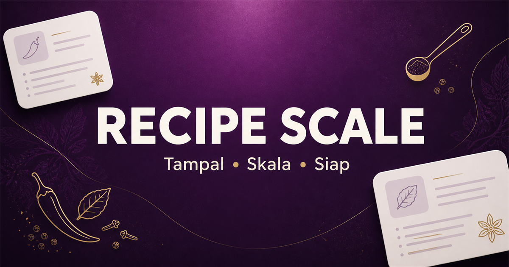

# Recipe Scale



Kalkulator sukatan resipi responsif untuk menyesuaikan bahan secara automatik mengikut jumlah tetamu.

**Production:** [enisabh.github.io/recipe-scale](https://enisabh.github.io/recipe-scale/)

## Fungsi utama

- Tampal resipi dalam Bahasa Melayu atau Inggeris.
- Skala sukatan untuk 1 hingga 500 orang.
- Fahami nombor perpuluhan, pecahan biasa dan pecahan Unicode.
- Tukar gram kepada kilogram serta mililiter kepada liter apabila sesuai.
- Bulatkan bahan kiraan seperti telur, bawang dan ulas.
- Kekalkan sukatan kualitatif seperti “sedikit garam” sebagai “secukup rasa”.
- Salin hasil ke clipboard, cetak resipi, reset dan buka panduan penggunaan.
- Susun atur responsif untuk desktop, tablet dan telefon.

## Teknologi

- React 19 dan TypeScript
- Vinext/Vite
- Tailwind CSS dan shadcn
- Lucide Icons
- OpenAI Sites dengan runtime Cloudflare Workers

## Menjalankan secara local

Keperluan: Node.js 22.13 atau lebih baharu.

```bash
npm install
npm run dev
```

Buka `http://localhost:3000` pada browser.

## Pengesahan

```bash
npm test
npm run lint
npm run build
```

Ujian automatik merangkumi penskalaan resipi, pecahan, penukaran unit dan format teks untuk fungsi Copy.

## Struktur penting

```text
app/page.tsx          Antaramuka dan interaksi utama
app/globals.css       Tema, responsif dan gaya cetakan
lib/recipe.ts         Parser serta enjin penskalaan
lib/recipe.test.ts    Ujian automatik pengiraan
public/og.png         Kad pratonton sosial
```

## Contoh

Resipi asal untuk 3 orang:

```text
3 cawan nasi
200g ayam
2 biji telur
```

Apabila ditukar untuk 100 orang:

```text
100 cawan nasi
6.67 kg ayam
67 biji telur
```

---

Dibina untuk memudahkan perancangan hidangan kecil, kenduri dan acara berskala besar.
